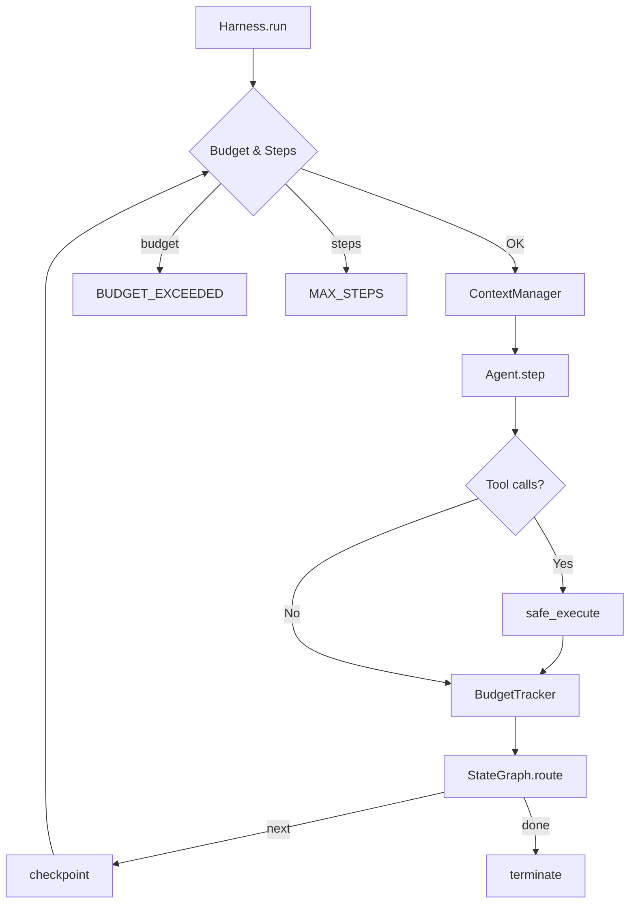

# Formally Verified LLM Orchestration

A Python orchestration harness for multi-agent LLM systems, formally verified in Lean 4. Companion code for the paper:

> **Formally Verified Harness Engineering: Using Lean 4 to Prove Correctness Properties of LLM Orchestration Code**
> Samy Djouder, 2026 — [`paper/paper.pdf`](paper/paper.pdf)

## Overview

LLM orchestration frameworks implement invariants that matter in production — token accounting, budget enforcement, bounded termination — yet none provide formal specifications or machine-checked proofs. This repository contains:

- **`src/excelsior_harness/`** — 780-LOC Python harness implementing the standard multi-agent orchestration architecture
- **`formal/`** — Lean 4 specification with 15 machine-checked theorems (no `sorry`)
- **`studies/mutation_testing/`** — three-phase mutation testing study (420 automated + 30 targeted + 11 spec-guided mutations)
- **`paper/`** — LaTeX source for the arXiv paper

## Formal Specification

The Lean 4 spec in [`formal/Lean4Learn/HarnessVerification.lean`](formal/Lean4Learn/HarnessVerification.lean) proves five well-formedness invariants over the orchestrator state machine:

| Invariant | Property |
|-----------|----------|
| P1 | Token accounting: `total = prompt + completion` |
| P2 | Budget safety: cost ≤ budget unless exhausted |
| P3 | Checkpoint monotonicity: checkpoints ≤ steps |
| P4 | Step bound: steps ≤ maxSteps + 1 |
| P5 | Termination consistency: budget_exceeded → done |

```bash
cd formal && lake build
```

## Installation

```bash
git clone https://github.com/Samsssd/formally-verified-llm-orchestration
cd formally-verified-llm-orchestration
pip install -e ".[dev]"
```

## Quickstart

```bash
python examples/basic_usage.py
```

Runs a supervisor → researcher → coder agent flow with mock LLM calls, demonstrating tool execution, budget tracking, and state transitions.

```python
from excelsior_harness import Harness, StateGraph, ToolRegistry, AgentState

registry = ToolRegistry()

@registry.register
def search(query: str) -> str:
    """Search for information."""
    return f"Results for: {query}"

# Build graph, attach agents, run harness
# See examples/basic_usage.py for the full working example
```

## Architecture

```
src/excelsior_harness/
├── _types.py       # Shared enums and type aliases
├── state.py        # Immutable AgentState with functional updates
├── budget.py       # Per-model cost tracking with hard USD ceiling
├── context.py      # Token counting + truncation (tiktoken)
├── tools.py        # Decorator-based tool registry + safe execution
├── agents.py       # Role-based agents + MockLLMClient
├── graph.py        # StateGraph with conditional edges
└── orchestrator.py # Main execution loop (budget/step/retry)
```



## Tests

```bash
pytest tests/ -v                          # unit + integration
pytest tests/test_properties.py -v        # property-based (Hypothesis)
```

65 tests total: 40 unit, 5 integration, 20 property-based.

## Mutation Testing Study

```bash
cd studies/mutation_testing
python analyze_mutmut.py        # Phase 1: automated baseline (420 mutants)
python run_empirical_study.py   # Phase 2: multi-method comparison (30 mutations)
python spec_guided_mutations.py # Phase 3: spec-guided mutations (11 mutations)
```

Results are in `AUTOMATED_RESULTS.md`, `RESULTS.md`, and `SPEC_GUIDED_RESULTS.md`.

## Key Findings

- Formal verification detects **80–91%** of mutations within its scope
- Lean 4 catches off-by-one budget boundary bugs that 65 tests miss
- Property-based testing catches 3 mutations that neither unit tests nor Lean detect
- One spec-guided mutation (`+=` → `=` in cost accumulation) passes both Lean and all tests, exposing a missing cost-monotonicity invariant
- 8 of 11 gap categories are structurally present in smolagents and pydantic-ai

## License

MIT
